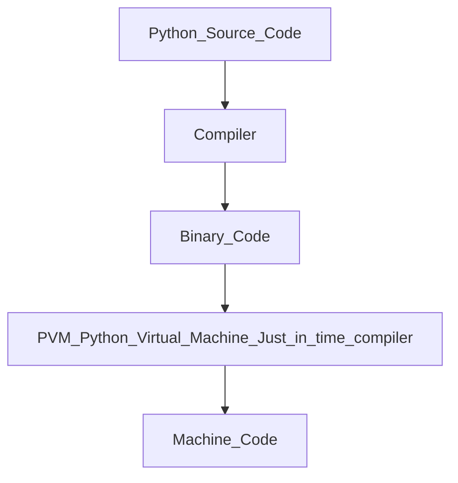

#### Q-1:What kind of language is Python?
<b>Ans:</b> Python is a general purpose ,Scripting Language.It is Dynamically Typed Object Oriented which also support Functional Programming.
- Dynamically Typed :Type of variable and Expression define during run Time.
- Every things in python is a Object
- Every things can be divided into small functions hence called as Functional Programming

#### Q-2:Is Python an Interpreted Language?
<b>Ans:</b>  Python Source Code->Compiler->Binary Code->(PVM Python Virtual Machine)Just in time compiler->Machine Code
    Interpreter Convert binary Code into the machine code and wait for next command by operating System.


#### Q-3:What is the difference between list and tuple?
<b>Ans:</b> In both we can store Heterogeneous, Indexing, Silicing Operator.
- list-[],mutable,more memmory consuming.
- Tuple-(),immutable,(index,count),less memmory consuming.

#### Q-4:How is memory managed in python?
<b>Ans:</b> Reference Variable in Stack Memory and Object in Private Heap Space
- Python Memory manager help to assigning the sapace
- Garbage Collector

#### Q-5:What is an identity operator?
<b>Ans:</b> <b>is</b> and <b>is not</b> it is used to cheque that different refere contain same Object
```python
x=5
y=5
z=9
print(x is y)#True
print(x is z)#True
```

#### Q-6:What is Monkey Patching?
<b>Ans:</b>
```python
class Test:
        def __init__(self,x):
            self.a=x
        def get_data(self):
            print("Some Code to Fetch data from databse")
        def f1(self):
            self.get_data()
        def f2(self):
            self.get_data()
    t1=Test(s)
    t1.f1()
    t2.f2()
    def new_get_data(self):
        print("Some code to fetch data from test data")
    Test.get_data=new_get_data
    print("After Monkey Patching")
    t1.f1()
    t2.f2()
```

#### Q-7:How to make generator to produce first N Prime numbers?
<b>Ans:</b>
```python
Yield
```

#### Q-8:How to implement variable length arguments in Python?
<b>Ans:</b>
```python
def average(*t):
        avg=sum(t)/len(t)
        print("Average is",avg)
    average(10,15,16)
    average(8,9,90,7,5,6)
```

#### Q-9:How to create instance member variables in a python class?
<b>Ans:</b>
```python
class Test:
        def __init__(self):
            self.a=5
        def f1(self):
            self.b=10
    t1=Test()#t1 object
    t2=Test()
    t1.f1()
    t1.c=15
    print(t1.__dict__)
```

#### Q-10:What is a lambda expression?
<b>Ans:</b>
```python
f=lambda a,b:a+b#a,b is argument
f(3,4)
``` 

#### Q-11:What is a list comprehension?
<b>Ans:</b>
```python
l=[expression for e in sequence ]
```

#### Q-12:Local Variable vs Global Variable ?
<b>Ans:</b>
```python
x=5#global variable
def f1():
     y=10#local variable
     print("x=%d y=%d"%(x,y))
f1()
print(x,y)
 ```
    
#### Q-13:What is decorator in Python?
<b>Ans:</b> Decorator is a function which takes another function as a argument and changes its funcnality.
```python
def decor_result(result_function):
    def distinction(marks):
        for m in marks:
            if m>=75:
                print("Distinction")
        result_function(marks)
    return distinction
@decor_result
def result(marks):
    for m in marks:
        if m>=33:
            pass
        else:
            print("FAIL")
    else:
        print("PASS")
result([50,60,70,80,75])
```

#### Q-14:What is an Iterator?
<b>Ans:</b> Iterable type ka object ka first stating point ko point karta hai
```python
my_list=[10,20,30,40,50,60]
it=iter(my_list)
while True:
    try:
        print(next(it))
    except StopIteration:
        break
``` 

#### Q-15:Does python support function overloading?
<b>Ans:</b> NO
```python
def f1():
    print("Hii")
def f1(a,b):
    print("Hello")
```
